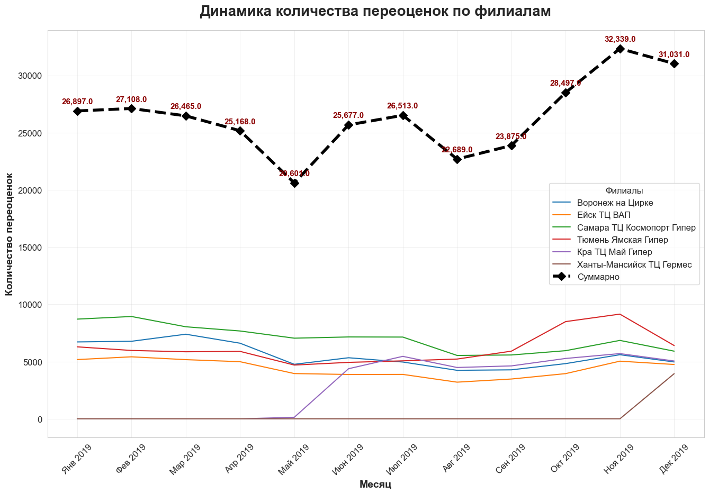

```python
import pandas as pd

import matplotlib.pyplot as plt
import seaborn as sns
from matplotlib.ticker import FuncFormatter
import matplotlib.dates as mdates
from datetime import datetime
import numpy as np
```


```python
pip install openpyxl
```

    Collecting openpyxl
      Downloading openpyxl-3.1.5-py2.py3-none-any.whl.metadata (2.5 kB)
    Collecting et-xmlfile (from openpyxl)
      Downloading et_xmlfile-2.0.0-py3-none-any.whl.metadata (2.7 kB)
    Downloading openpyxl-3.1.5-py2.py3-none-any.whl (250 kB)
    Downloading et_xmlfile-2.0.0-py3-none-any.whl (18 kB)
    Installing collected packages: et-xmlfile, openpyxl
    
       -------------------- ------------------- 1/2 [openpyxl]
       -------------------- ------------------- 1/2 [openpyxl]
       ---------------------------------------- 2/2 [openpyxl]
    
    Successfully installed et-xmlfile-2.0.0 openpyxl-3.1.5
    Note: you may need to restart the kernel to use updated packages.
    


```python
file_path = 'Переоценки по 5 филиалам.xlsx'

excel = pd.ExcelFile(file_path)

months = excel.sheet_names

data = {}

for month in months:
    df = pd.read_excel(excel, sheet_name=month, header=None)
    total_cols = df.columns[df.iloc[1] == 'Всего'].tolist()
    
    for row_idx in range(2, len(df)):
        branch = df.iloc[row_idx, 0]
        if pd.isna(branch):  # Skip empty rows
            continue
        sum_total = df.iloc[row_idx, total_cols].sum()
        if branch not in data:
            data[branch] = {}
        data[branch][month] = sum_total

df_table = pd.DataFrame.from_dict(data, orient='index')
df_table = df_table.fillna(0)
df_table = df_table[sorted(df_table.columns)]
df_table.loc['Суммарно'] = df_table.sum(axis=0)

df_table
```


<div>
<style scoped>
    .dataframe tbody tr th:only-of-type {
        vertical-align: middle;
    }

    .dataframe tbody tr th {
        vertical-align: top;
    }

    .dataframe thead th {
        text-align: right;
    }
</style>
<table border="1" class="dataframe">
  <thead>
    <tr style="text-align: right;">
      <th></th>
      <th>01.19</th>
      <th>02.19</th>
      <th>03.19</th>
      <th>04.19</th>
      <th>05.19</th>
      <th>06.19</th>
      <th>07.19</th>
      <th>08.19</th>
      <th>09.19</th>
      <th>10.19</th>
      <th>11.19</th>
      <th>12.19</th>
    </tr>
  </thead>
  <tbody>
    <tr>
      <th>Воронеж на Цирке</th>
      <td>6719.0</td>
      <td>6776.0</td>
      <td>7392.0</td>
      <td>6607.0</td>
      <td>4763.0</td>
      <td>5337.0</td>
      <td>4963.0</td>
      <td>4239.0</td>
      <td>4281.0</td>
      <td>4824.0</td>
      <td>5602.0</td>
      <td>4970.0</td>
    </tr>
    <tr>
      <th>Ейск ТЦ ВАП</th>
      <td>5178.0</td>
      <td>5419.0</td>
      <td>5171.0</td>
      <td>4992.0</td>
      <td>3956.0</td>
      <td>3874.0</td>
      <td>3882.0</td>
      <td>3204.0</td>
      <td>3479.0</td>
      <td>3950.0</td>
      <td>5038.0</td>
      <td>4748.0</td>
    </tr>
    <tr>
      <th>Самара ТЦ Космопорт Гипер</th>
      <td>8711.0</td>
      <td>8940.0</td>
      <td>8043.0</td>
      <td>7675.0</td>
      <td>7046.0</td>
      <td>7153.0</td>
      <td>7143.0</td>
      <td>5538.0</td>
      <td>5578.0</td>
      <td>5954.0</td>
      <td>6852.0</td>
      <td>5912.0</td>
    </tr>
    <tr>
      <th>Тюмень Ямская Гипер</th>
      <td>6289.0</td>
      <td>5973.0</td>
      <td>5859.0</td>
      <td>5894.0</td>
      <td>4698.0</td>
      <td>4933.0</td>
      <td>5066.0</td>
      <td>5223.0</td>
      <td>5912.0</td>
      <td>8494.0</td>
      <td>9148.0</td>
      <td>6404.0</td>
    </tr>
    <tr>
      <th>Кра ТЦ Май Гипер</th>
      <td>0.0</td>
      <td>0.0</td>
      <td>0.0</td>
      <td>0.0</td>
      <td>138.0</td>
      <td>4380.0</td>
      <td>5459.0</td>
      <td>4485.0</td>
      <td>4625.0</td>
      <td>5275.0</td>
      <td>5699.0</td>
      <td>5053.0</td>
    </tr>
    <tr>
      <th>Ханты-Мансийск ТЦ Гермес</th>
      <td>0.0</td>
      <td>0.0</td>
      <td>0.0</td>
      <td>0.0</td>
      <td>0.0</td>
      <td>0.0</td>
      <td>0.0</td>
      <td>0.0</td>
      <td>0.0</td>
      <td>0.0</td>
      <td>0.0</td>
      <td>3944.0</td>
    </tr>
    <tr>
      <th>Суммарно</th>
      <td>26897.0</td>
      <td>27108.0</td>
      <td>26465.0</td>
      <td>25168.0</td>
      <td>20601.0</td>
      <td>25677.0</td>
      <td>26513.0</td>
      <td>22689.0</td>
      <td>23875.0</td>
      <td>28497.0</td>
      <td>32339.0</td>
      <td>31031.0</td>
    </tr>
  </tbody>
</table>
</div>


```python

df_plot = df_table.copy()
df_plot = df_plot.drop('Суммарно')
df_total = df_table.loc['Суммарно']

month_map = {
    '01.19': 'Янв 2019', '02.19': 'Фев 2019', '03.19': 'Мар 2019',
    '04.19': 'Апр 2019', '05.19': 'Май 2019', '06.19': 'Июн 2019',
    '07.19': 'Июл 2019', '08.19': 'Авг 2019', '09.19': 'Сен 2019',
    '10.19': 'Окт 2019', '11.19': 'Ноя 2019', '12.19': 'Дек 2019'
}
x_labels = [month_map[col] for col in df_plot.columns]

fig, ax = plt.subplots(figsize=(16, 10))

colors = sns.color_palette("husl", len(df_plot))
for i, branch in enumerate(df_plot.index):
    ax.plot(x_labels, df_plot.loc[branch], label=branch)

ax.plot(x_labels, df_total, 
        color='black', linewidth=4, marker='D', markersize=8,
        label='Суммарно', linestyle='--')

# числа на кривой
for i, (month, value) in enumerate(df_total.items()):
    ax.annotate(f'{value:,}', 
                (i, value), 
                textcoords="offset points", 
                xytext=(0,10), 
                ha='center', fontsize=11, fontweight='bold', color='darkred')

ax.set_title('Динамика количества переоценок по филиалам', 
             fontsize=20, fontweight='bold', pad=20)
ax.set_ylabel('Количество переоценок', fontsize=14, fontweight='bold')
ax.set_xlabel('Месяц', fontsize=14, fontweight='bold')

ax.legend(title='Филиалы', loc='best')

plt.xticks(rotation=45)

plt.show()
```


    

    


```python

time_tag = 2
salary = 50000
work_hour = 164 # 1970 раб.часов в 2019 / 12
hour_rate = salary / work_hour #304.88

df_branches = df_table.drop('Суммарно', errors='ignore')

# без Ханты-Мансийск ТЦ Гермес
branches = [
    'Воронеж на Цирке',
    'Ейск ТЦ ВАП',
    'Самара ТЦ Космопорт Гипер',
    'Тюмень Ямская Гипер',
    'Кра ТЦ Май Гипер'
]

# Расчёт среднего и стоимости
result = []
for branch in branches:
    avg = round(df_branches.loc[branch].mean())  # среднее по 12 месяцам
    
    # Время в часах
    hours = (avg * time_tag) / 60
    # Стоимость
    cost = round(hours * hour_rate, 2)
    
    result.append({
        'Филиал': branch,
        'Среднее кол-во переоценок в месяц': avg,
        'Стоимость процесса в месяц (руб.)': cost
    })

df_cost = pd.DataFrame(result)

avg_reval_all = df_cost['Среднее кол-во переоценок в месяц'].mean()
avg_cost_all = df_cost['Стоимость процесса в месяц (руб.)'].mean()
cost_all = df_cost['Стоимость процесса в месяц (руб.)']

df_cost.loc[len(df_cost)] = [
    'Среднее по филиалам',
    '—',  # прочерк вместо числа
    round(avg_cost_all, 2)
]
df_cost.loc[len(df_cost)] = [
    'Стоимость всего',
    '—',  # прочерк вместо числа
    cost_all.sum()
]
```


```python
df_cost
```


<div>
<style scoped>
    .dataframe tbody tr th:only-of-type {
        vertical-align: middle;
    }

    .dataframe tbody tr th {
        vertical-align: top;
    }

    .dataframe thead th {
        text-align: right;
    }
</style>
<table border="1" class="dataframe">
  <thead>
    <tr style="text-align: right;">
      <th></th>
      <th>Филиал</th>
      <th>Среднее кол-во переоценок в месяц</th>
      <th>Стоимость процесса в месяц (руб.)</th>
    </tr>
  </thead>
  <tbody>
    <tr>
      <th>0</th>
      <td>Воронеж на Цирке</td>
      <td>5539</td>
      <td>56290.65</td>
    </tr>
    <tr>
      <th>1</th>
      <td>Ейск ТЦ ВАП</td>
      <td>4408</td>
      <td>44796.75</td>
    </tr>
    <tr>
      <th>2</th>
      <td>Самара ТЦ Космопорт Гипер</td>
      <td>7045</td>
      <td>71595.53</td>
    </tr>
    <tr>
      <th>3</th>
      <td>Тюмень Ямская Гипер</td>
      <td>6158</td>
      <td>62581.30</td>
    </tr>
    <tr>
      <th>4</th>
      <td>Кра ТЦ Май Гипер</td>
      <td>2926</td>
      <td>29735.77</td>
    </tr>
    <tr>
      <th>5</th>
      <td>Среднее по филиалам</td>
      <td>—</td>
      <td>53000.00</td>
    </tr>
    <tr>
      <th>6</th>
      <td>Стоимость всего</td>
      <td>—</td>
      <td>265000.00</td>
    </tr>
  </tbody>
</table>
</div>


```python
# рассчет срока окупаемости проекта


e_price = 400 # стоимость электронных ценников шт.
num_goods = 5000 # количество товаров на витрине филиала
branch_loss = 50000 # потери розничного филиала при продаже по неактуальным ценам
salary = 50000 # оплата труда сотрудника

total = 5 * e_price * num_goods # общая стоимость проекта (на 5 филиалов)

save_prices = 5 * branch_loss # экономия на потерях от неактуальных цен
save_salary = cost_all.sum() # экономия на оплате труда
total_save = save_prices + save_salary # общая экономия

payback = total / total_save # срок окупаемости, в месяцах

print(f'Общая стоимость проекта (на 5 филиалов): {total}.\n'
f'Экономия на потерях от неактуальных цен: {save_prices}.\n'
f'Экономия на оплате труда: сумма стоимостей процесса по 5 филиалам = {save_salary}.\n'
f'Общая ежемесячная экономия: {total_save}.\n'
f'Срок окупаемости: {round(payback, 2)} месяцев или {round(payback / 12, 2)} лет.')
```

    Общая стоимость проекта (на 5 филиалов): 10000000.
    Экономия на потерях от неактуальных цен: 250000.
    Экономия на оплате труда: сумма стоимостей процесса по 5 филиалам = 265000.0.
    Общая ежемесячная экономия: 515000.0.
    Срок окупаемости: 19.42 месяцев или 1.62 лет.
    


```python

```
